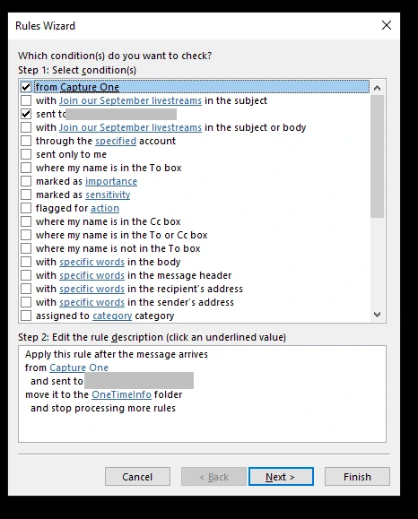
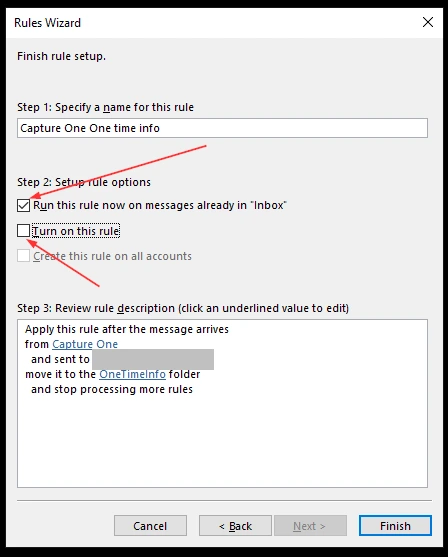
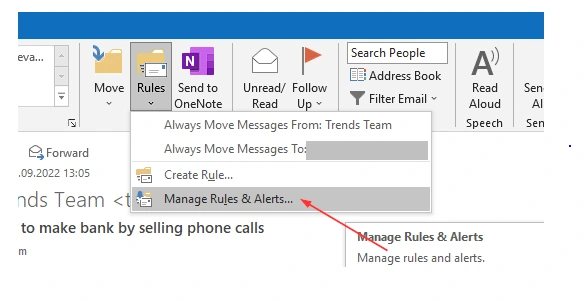
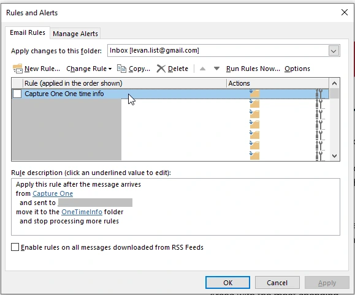

# How to run Outlook rules once

I have not found an "official" way. You could write your own macros, but that's not something anyone wants to do.

I have found a easy workaround that you may apply. 

So, create you rule

Click "Next" until the last page

Then!

Select "Run this rule now on messages already in Inbox"

**Deselect**  "Turn on this rule" 

Click Finish to run this rule once

If you want to execute this rule again, you must to go to the "Manage Rule & Alerts..."

Double click your rule

Repeat the above steps by clicking "Next" until you reach the last page. 

As before, select "Run this rule now on messages already in Inbox"

Click "Finish" to run this rule again

