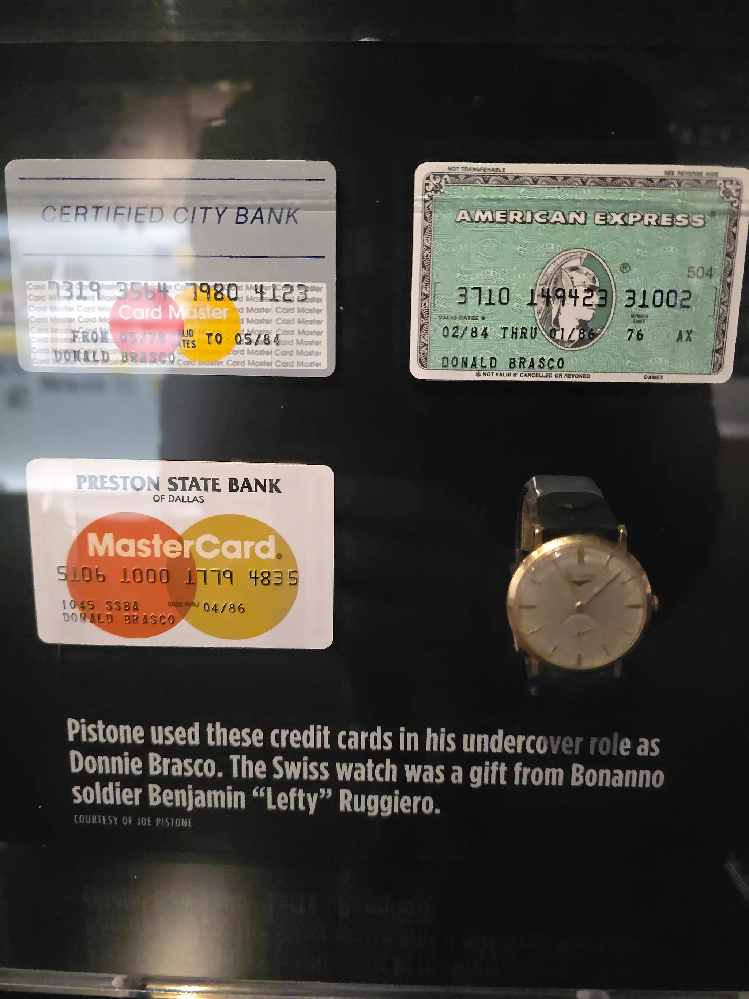

	

		
			<a class="md-toc-inner" href="#δύο-σκ-στην-αμερική">Δύο ΣΚ στην Αμερική</a>
		
		
			<a class="md-toc-inner" href="#εισαγωγή">Εισαγωγή </a>
		
		
			<a class="md-toc-inner" href="#γενικές-εντυπώσεις----σχόλια---random-παρατηρήσεις">Γενικές εντυπώσεις – Σχόλια - Random παρατηρήσεις </a>
		
		
			<a class="md-toc-inner" href="#η-πτήση">Η πτήση</a>
		
		
			<a class="md-toc-inner" href="#reno-nevada">Reno Nevada</a>
		
		
			<a class="md-toc-inner" href="#san-francisco">San Francisco</a>
		
		
			<a class="md-toc-inner" href="#las-vegas">Las Vegas</a>
		
		
			<a class="md-toc-inner" href="#lake-tahoe">Lake Tahoe</a>
		
		
			<a class="md-toc-inner" href="#virginia-city">Virginia City</a>
		
		
			<a class="md-toc-inner" href="#μουσεία">Μουσεία</a>
		
		
			<a class="md-toc-inner" href="#san-francisco-museum-of-modern-art">San Francisco Museum of Modern Art</a>
		
		
			<a class="md-toc-inner" href="#las-vegas-the-mob-museum">Las Vegas The Mob Museum</a>
		
		
			<a class="md-toc-inner" href="#las-vegas-atomic-museum">Las Vegas Atomic Museum</a>
		
		
			<a class="md-toc-inner" href="#nevada-state-museum-carson-city">Nevada State Museum Carson City</a>
		
		
			<a class="md-toc-inner" href="#chollar-mine-virginia-city---ορυχείο">Chollar mine Virginia City - Ορυχείο</a>
		
		
			<a class="md-toc-inner" href="#the-way-it-was-museum-virginia-city">The Way It Was Museum Virginia City</a>
		
		
			<a class="md-toc-inner" href="#nevada-museum-of-art-reno">Nevada Museum of Art Reno</a>
		
		
			<a class="md-toc-inner" href="#national-automobile-museum-reno">National Automobile Museum Reno</a>
		
	

# Δύο ΣΚ στην Αμερική

## Εισαγωγή 

Είτε την αγαπάμε είτε την μισούμε, η Αμερική είναι ένα ιδιαίτερο μέρος και οι περισσότεροι από εμάς θέλουμε κάποια στιγμή στην ζωή μας να την επισκεφτούμε. 

Η Εταιρία που δουλεύω έχει γραφεία στο Reno στην Νεβάδα και με στείλανε εκεί. 

Εξ αρχής το πλάνο ήταν να κάτσω για 10 μέρες τελικά όμως με αλλάξανε τα εισιτήρια και κάθισα δύο εβδομάδες (06/01/25 – 20/01/2025). Οπότε είχα δύο σαββατοκύριακα στην διάθεσή μου. 

Τις καθημερινές είχα κάποιο ελεύθερο χρόνο μετά την δουλεία αλλά στο Reno δεν έχει πολλά να κάνεις.

Στο πρώτο ΣΚ πέταξα στον San Fransisco και μετά στο Las Vegas. Στο Δεύτερο ενοικίασα ένα αμάξι. Έκανα μια βόλτα γύρο από την Λίμνη Τάχο (Lake Tahoe) και επισκέφτηκα την άγρια δύση στην Virginia City.

## Γενικές εντυπώσεις – Σχόλια - Random παρατηρήσεις 
- Στα αεροδρόμια πρέπει να βγάζεις τα παπούτσια στον έλεγχο (μόνο στην Ρωσία θυμάμαι κάτι παρόμοιο). Επίσης, γίνετε πάντα έλεγχος διαβατηρίου. 
- Η Southwest Airlines δεν σου δίνη θέσει στο αεροπλάνο. Μπαίνεις με μία σειρά προτεραιότητας (κάπως περίεργη, όχι 1-5 όπως σε άλλες αεροπορικές) και όπου θες κάθεσαι. 
- Όσοι είναι ενεργή στον στρατό έχουν προτεραιότητα να μπουν στο αεροπλάνο και στην ανακοίνωση για το ξεκίνημα της επιβίβασης λένε πάντα το κλασικό «thank you for your service». 
- Στο αεροπλάνο δεν λένε «φοράτε την ζώνη σας…» αλλά λένε «σύμφωνα με τον ομοσπονδιακό νόμο είστε υποχρεωμένη να φοράτε την ζώνη σας…»
- Έχω την εντύπωση ότι στην Αμερική η κάθοδος στα αεροπλάνα (descent rate) είναι πιο απότομη από ότι στην Ευρώπη. 
- Σχεδόν σε όλα τα εστιατόρια, ακόμα και σε κάτι μικρά σε δείχνουν αυτοί το που θα κάτσεις. Η σερβιτόροι σχεδόν πάντα παρουσιάζονται «Hi, welcome to Wild River Grille, I am Keyla, I’ll be taking care of you tonight». Επίσης, κάθε 10 λεπτά σε ρωτάνε «Is it everything ok here?». Αν δούνε ότι τελείωσες με το φαγητό σε ρωτάνε «θέλετε τίποτα άλλο ή να σας φέρω τον λογαριασμό;» Σε κάποια δεν σε ρωτάνε καν, σε φέρνουν τον λογαριασμό…  
- Όλους τους χυμούς και τα νερά τα φέρνουν με 2 κιλά παγάκια μέσα. 
- Η πληρωμή σε πολλά εστιατόρια γίνετε σε 2 φάσεις. Δίνεις την κάρτα σου να πληρώσεις. Μετά σε φέρνουν μία απόδειξη με έναν στύλο και πρέπει να γράψεις πόσα tips θέλεις να δώσεις και να υπογράψεις. 15%-20% είναι το πιο συνηθισμένο.
- Στα μαγαζιά, όλες οι τιμές είναι χωρίς τους φόρους. Ο φόρος είναι συνήθως από 7% με 8.5%. 
- Στην τηλεόραση έχει διαφημίσεις ανά 8-10 λεπτά. Διαφημίζουν κάτι φάρμακα για αδυνάτισμα τα οποία μπορούν να προκαλέσουν τάσεις αυτοκτονίας… 
- Έτυχε να καλέσω Uber και να έρθει ένας με ένα τεράστιο αμερικάνικο αγροτικό pickup truck. Γενικά εκεί έχουν πολλοί τέτοια pickup και τα έχουν σαν αμάξι. Δεν τα αγοράζουν γιατί τα χρειάζονται σαν αγροτικό. 
- Όταν οδηγείς σε δρόμο με στροφές, πριν την στροφή έχει πινακίδα που σε προειδοποιεί με πόσα μίλια την ώρα πρέπει να πάρεις την στροφή.

- Τα καπάκια δεν είναι κολλημένα στα μπουκάλια. 
- Πολύ σπαστικό ήταν, όταν λες «thanks» και σε απαντάνε με «ugu» ή «aha»…
- Για το ίντερνετ συμφέρει προφανώς κάποια E-Sim. Εγώ το Airlaro χρησιμοποίησα. Δεν είχα κανένα πρόβλημα. Είχε καλή σύνδεση σχεδόν παντού. Στην Virginia City μόνο κολλούσε λίγο. 
- Για τηλεφωνήματα στην Ευρώπη που χρειάστηκα, το Yolla κατέβασα.  

## Η πτήση
Το ταξίδι ξεκίνησε από το Bonaduz. Περίπου δύο ώρες μέχρι το αεροδρόμιο της Ζυρίχης. Από εκεί με το αεροπλάνο Frankfurt am Main – San Francisco – Reno NV. Έκανα περίπου 26 ώρες από το σπίτι μου μέχρι το ξενοδοχείο στο Reno. 

Στο San Francisco περνάς προφανώς από έλεγχο διαβατηρίου. Σκανάρουν το διαβατήριο, σε βγάζουν φωτογραφία (σε όλα τα αεροδρόμια που πέταξα στην Αμερική σε βγάζουν φωτογραφία και ο υπολογιστής με το λεγόμενο «Facial Recognition Technology» συγκρίνει αυτήν την φωτογραφία με την φωτογραφία από το διαβατήριο), σε παίρνουν δακτυλικά αποτυπώματα και σε ρωτάνε γιατί ήρθες, πόσο θα κάτσεις κτλ. 

Στην περίπτωσή μου ήταν επαγγελματικό το ταξίδι. Επειδή δεν είχα καμιά επίσημή πρόσκληση από την εταιρία μου και ήμουν πρώτη φορά στην Αμερική (έτσι με είπαν)  με πήρανε για περαιτέρω εξακρίβωση.

Με βάλανε σε ένα μικρό σκονισμένο δωμάτιο, όπως στις ταινίες και για κάνα 10 λεπτά με κάνανε ανάκριση. Που δουλεύω, που σπούδασα, που μεγάλωσα, έχω πάει στο Ιράκ ή στην κούβα τα τελευταία χρόνια κλπ.

Οπότε, καλό είναι να έχετε μαζί σας την κράτηση του ξενοδοχείου, τα εισιτήρια της επιστροφής και αν είναι το ταξίδι επαγγελματικό, να έχετε μία πρόσκληση από την εταιρία για την οποία δουλεύετε. Μπορεί να είναι ακόμα και σε E-Mail. 

Επίσης, έπρεπε να παραλάβω την βαλίτσα μου στο San Francisco και να την πάω στο Bag Drop για την επόμενη πτήση. Δεν ξέρω γιατί δεν την πάνε μόνη τους. Μάλλον, σε περίπτωση που σε απαγορευτεί η είσοδος στην χώρα, να μην ψάχνουν την βαλίτσα σου στο άλλο αεροπλάνο.

Εκτός από αυτά, σε περίπτωση μετεπιβίβασής πρέπει να ξαναπεράσεις μέσα από έλεγχο εφόσον έρχεσαι από πτήση εκτός Αμερικής. 

Φτάνοντας στο Reno αυτό μου με έκανε εντύπωση είναι το ότι έχουνε φρουτάκια μέσα στο αεροδρόμιο. Περιμένοντάς στο Gate μπορείς να δοκιμάσεις την τύχη σου. 

## Reno Nevada

Το Reno είναι η τέταρτη σε πληθυσμό πόλη στην Νεβάδα με περίπου 280.000 κατοίκους. Το 20% είναι Latinos.  Πρώτη σε πληθυσμό στην Νεβάδα είναι το Las Vegas με 665.000.  

Είναι περιτριγυρισμένη με βουνά με σχετικά ήπιο καιρό και με πάνω από 300 μέρες ήλιο το χρόνο. Στις δύο εβδομάδες που ήμουνα εκεί ένα σύννεφο δεν είδα. Η θερμοκρασία ήταν γύρο στους 0 °C με 8 °C βαθμούς. 

Ή πόλη είναι γεμάτη με τεράστια ξενοδοχεία-καζίνο. Εγώ έμεινα στο Grand Sierra Resort and Casino. 

Αλλά εκτός από αυτό δεν έχει τίποτα το ιδιαίτερο. 

Οι άνθρωποι είναι ομιλητικοί και ευγενική. 

Ένα απόγευμα, όταν είχε πλέων νυχτώσει, έκανα μία βόλτα στο κέντρο. Με τα πόδια ήμουν μόνο εγώ και κάτι άστεγοι. 

Το στέκι μου ήταν μία Ιρλανδέζικη Pub (Ceol Irish Pub). Με έκανε εντύπωση, που γνωρίζονται μαζί σου και σημειώνουν το όνομα σου. Όταν πήγα δεύτερη φορά, ο ιδιοκτήτης, ο Ron, από την πόρτα με χαιρέτησε. 

*-Hi Levan, how was your day? Take a seat.* 

Δεν ξέρω αν είναι σε όλες τις Pub έτσι εκεί αλλά όπως και να έχει είναι ευχάριστο. 
Η Guinness έκανε 8$ και ένα νορμάλ Whiskey στα 15$. Είχε πάνω από 80 Whiskeys να διαλέξεις. 

Την φώτο έρεπε να την βγάλω πριν μπω μέσα.  

## San Francisco

Στο San Francisco δεν είχα πολύ χρόνο. Προσγειώθηκα στις 09:30 και η πτήση για το Las Vegas ήταν στης 22.30. Οπότε είχα κάνα 8 ώρες. Αυτά που ήθελα σίγουρα να κάνω είναι να δω το Golden Gate Bridge, να επισκεφτώ το MoMA (Museum of Modern Art) και να κάνω προφανώς μία βόλτα στην πόλη. Ο καιρός παρεμπίπτοντος ήταν τέλειος. 18 °C με δροσερό αεράκι.

Από το αεροδρόμια πήρα ένα Uber για το Chinatown. Στο αεροδρόμιο έχουν ειδικά μέρη αποκλειστικά για τα Uber ή Lyft. Στο App Επιλέγεις π.χ. D5 και έρχεται εκεί ο οδηγός. Το Uber ήταν σχετικά φτηνό. Για 25 χλμ. πλήρωσα 35$. Τα ταξί είναι σχεδόν δύο φορές πιο ακριβά. 

Οπότε πρώτη στάση ήταν το Chinatown.

Η Chinatown στο Σαν Φρανσίσκο είναι η παλαιότερη και μεγαλύτερη Chinatown στη Βόρεια Αμερική και μία από τις μεγαλύτερες κινεζικές συνοικίες εκτός Ασίας. 

Στην Chinatown θα βρείτε σχετικά φτηνά σουβενίρ (βασικό!), κινέζική αρχιτεκτονική και κινέζους.

Από την Chinatown περπάτησα μέχρι το MoMa

Μετά από 2,5 ευχάριστες ώρες στο MoMa πήρα ένα Uber για το λιμάνι. 

Με το καραβάκι πλεύσαμε στην εικονική Golden Gate Bridge.

 

Η θέα από το καράβι ήταν εξαιρετική. 

Μας έκανε βόλτα κάτω από την γέφυρα και μετά ένα κύκλο γύρο από το Alcatraz.

To τουρ με καράβι το έκλεισα μέσο του Viator. Έκανε 38$. 

 Η πόλη γενικά ήταν πανέμορφη.  Με φανταστικά κτήρια και ωραία αρχιτεκτονική.  

Αυτή είναι η λεγόμενη «Transamerica Pyramid».

Αλλά κάτι ανηφόρες... 

Στο google maps πρέπει πάντα να κοιτάς το υψόμετρο που έχεις να ανέβεις. 

Ο πληθυσμός είναι περίπου στης 800.000. Τα εστιατόρια γενικά τσιμπάνε λίγο. Με φάνηκε επίσης ότι έχει πολλούς Ασιάτες εκεί, οπότε το έψαξα. Περίπου 300.000 Ασιάτες μένουν εκεί.

Οι άνθρωποι ευγενική και όλοι παραπονιούνται για το πρόβλημα με τους αστέγους και τους χρήστες. Με είπαν ότι αν κλέψεις κάτω από 1000$, σε αφήνουν ελεύθερο και για αυτό γίνονται πολλές μικροκλοπές. Πάνο από 150 διαρρήξεις σε αμάξια την ημέρα. Ο ταρίφας με είπε και 2$ να αφήσεις στο αμάξι θα στο σπάσουν. Η χειρότερη περιοχή με όλα τα «καλά» παιδιά είναι το Tenderloin. Σαν πόλη θεωρείτε από τις πιο ασφαλές στην Αμερική. Απλός δεν πρέπει να είσαι στο λάθος μέρος την λάθος ώρα. 

Στο San Francisco έχει επίσης δεκάδες (αν όχι παραπάνω) ταξί χωρίς οδηγό. Τα λεγόμενα Waymo. 

Όταν πέφτει ο Ήλιος οι δρόμοι αδειάζουν. Δεν περπατάει πολύς κόσμος έξω. 

Στο κέντρο είχε και κάτι πατσάνια με φουλ μουσική. 

<video width="100%" controls >
  <source preload="none" autoplay="false"  loop="false" src="/posts/2025/01/25/trip-to-usa/patsania-San-Francisco.mp4" type="video/mp4">
</video>

 Για να πάω αεροδρόμιο είπα να δοκιμάσω το μετρό ή όπως το λένε εκεί BART (Bay Area Rapid Transit). Αγοράζεις μία κάρτα με 3$ και την φορτώνεις με όσα λεφτά χρειάζεσαι. Μέχρι το αεροδρόμιο είναι 11.15$. Ένας νεαρός πήδηξε μπροστά μου από τα κάγκελα για να μην πληρώσει. 

H στάση (Civic Center) βρόμικη, τα τρένα (από έξω τουλάχιστον) βρόμικα και πολύ λίγος κόσμος. Ήμουν Σάββατο κατά της 19.30 εκεί. 

Το μετρό σε αφήνει σε μία γέφυρα στο αεροδρόμιο και από εκεί παίρνεις ένα άλλο τρενάκι που σε πάει στο terminal που χρειάζεσαι. 

Το San Francisco απο το αεροπλάνο.

Από εκεί πρόσω ολοταχώς για το Las Vegas.

## Las Vegas

Στο Vegas έφτασα μεσάνυχτα. 

Και εδώ προφανώς φρουτάκια στο αεροδρόμιο μέσα. 

Το τρενάκι με το οποίο πας στην έξοδο δεν λειτουργούσε. Από την έξοδο κίνδυνου βγήκαμε. 

Ο Ταρίφας με έκανε κάνα 2 κύκλους και με πήρε 30 τάλαντά για ούτε 5κμ απόσταση. 

Παρεμπιπτόντως, τα ταξί και τα Uber στο Las Vegas απαγορεύετε να σταματάνε όπου νάνε για να παραλάβουν επιβάτες. Υπάρχουν συγκεκριμένα σημεία. Τα περισσότερα μπροστά από ξενοδοχεία.

Το πρόγραμμα μου ήταν να επισκεφτώ το Mob Museum (Μουσείο της μαφίας), το μουσείο ατομικής ενέργειας, να βγάλω φωτογραφία το γνωστό «Welcome to Las Vegas» και προφανώς να κάνω βόλτα στο λεγόμενο «Las Vegas Strip». Είναι ο δρόμος που έχει όλα τα τεράστια ξενοδοχεία και καζίνο. 

‘Αν αναρωτιέστε γιατί πήγα εκεί. Ήμουν ανάμεσα σε Las Vegas και Los Angeles. Διάλεξα το Las Vegas διότι είναι μία πιο ιδιαίτερη πόλη σε σχέση με το LA. Στην τελική ήμουν και τυχερός γιατί εκείνες τις ημέρες καιγόταν το LA. 

Την πόλη θα την χαρακτήριζα σαν «εντυπωσιακή». Τεράστια ξενοδοχεία με φανταστική και σχετικά πρωτότυπη αρχιτεκτονική θα έλεγα. Ο καιρός μέσα Γενάρη 10 °C βαθμούς με πολύ ήλιο. 

Παντού υπάρχει και ένας Έλληνας.

Για να βγεις φώτο μπροστά στο σήμα πρέπει να περιμένεις ουρά από τουρίστες.

Εγώ εννοείτε δεν περίμενα. Μπορείς να βγεις και από τα πλάγια  : )

Το βράδυ η πόλη μεταμορφώνεται σε ένα Χριστουγεννιάτικο δέντρο. Όλα λάμπουν και από παντού ακούγετε μουσική. Επίσης είχε πάρα πολύ κόσμο στο κέντρο.

<video width="100%" controls >
  <source preload="none" autoplay="false"  loop="false" src="/posts/2025/01/25/trip-to-usa/Las-Vegas-New-York.mp4" type="video/mp4">
</video>

Πολλοί μαζεύονται μπροστά στο Bellagio για να δούνε το show με το σιντριβάνι. 

<video width="100%" controls >
  <source preload="none" autoplay="false"  loop="false" src="/posts/2025/01/25/trip-to-usa/Las-Vegas-Bellagio-Show.mp4" type="video/mp4">
</video>

<video width="100%" controls >
  <source preload="none" autoplay="false"  loop="false" src="/posts/2025/01/25/trip-to-usa/Las-Vegas-Bellagio.mp4" type="video/mp4">
</video>

Πίσω στο Reno πέταξα με ένα Boeing 737 MAX 8. Το 2018 και το 2019 είχανε πέσει 2 τέτοια λόγο ενός προβλήματος στον υπολογιστή και το 2024 έφυγε μία πόρτα μετά την απογείωση. 

## Lake Tahoe

Η λίμνη Tahoe είναι μία σχετικά μεγάλη και πολύ όμορφη λίμνη ανάμεσα σε βουνά σε υψόμετρο περίπου 1.900μ. Την μοιράζονται δύο πολιτείες. Η Νεβάδα και η Καλιφόρνια. 

Επειδή η λίμνη ήταν σχετικά κοντά στο Reno, ενοικίασα ένα αμάξι και την γύρισα. 

Στην αρχή πήγα στην Carson City. Η πόλη δεν είχε τίποτε το αξιοσημείωτο εκτός από το Nevada State Museum.

Επόμενη στάση ήταν ένα τεμέκ ελληνικό εστιατόριο στα νότια της λίμνης. 

Έλληνα δεν βρήκα εκεί. Ο σερβιτόρος ήταν μεξικάνος και ένας μάγειρας που βγήκε από την κουζίνα με φάνηκε Λατίνος. Το μόνο ελληνικό ήταν η πίτα θα έλεγα. Αλλά σε νοστιμιά ήταν οκ.

Από εκεί έκανα ένα κύκλο την λίμνη. 

Η διαδρομή ήταν ευχάριστη. Σε κάποια σημεία δεξιά αριστερά είχε χιόνια αλλά ο δρόμος ήταν καθαρός.

Επειδή ήταν Σάββατο, τα πιο διάσημα σημεία να σταματήσεις ήταν γεμάτα. Δεν βρήκα που να παρκάρω. Άλλα και εκεί που βρήκα να σταματήσω ήταν όμορφα. 

## Virginia City

Μία μικρή πόλη στην Νεβάδα η οποία ήταν κάποτε από της ποιο πλούσιες πόλεις του κόσμου. Ήταν γεμάτη σε χρυσό και ασημή. Περίπου από το 1860 μέχρι 1880 τα ορυχεία δουλεύαν ασταμάτητα. Ο πληθυσμός της τότε είχε φτάσει στης 25.000 ενώ σήμερα είναι λιγότερη από 1000 καουμπόηδες που μένουν εκεί. 

Η διαδρομή από το Reno ήταν ωραία. Ανεβαίνεις ψηλά και αποκαλύπτονται όμορφες θέες στα βουνά. 

Εννοείτε επισκέφτηκα και εκεί ένα μουσείο. Το The way it was museum. Είχε αντικείμενα από την περίοδο της «άγριας δύσης». Επίσης έκανα και ένα τουρ σε ένα ορυχείο. 

Η πόλη γενικά είναι διάσημη και αρκετά τουριστική διότι έχει το στιλ της άγριας δύσης με παλιά κτίρια και σαλούν.

No comments

Όταν δεν έχει μοντέρνα αμάξια παρκαρισμένα, δεν θα μπορούσες να πεις ότι οι φωτογραφίες είναι του 2025. 

Η πόλη είναι πολύ μικρή. Με τα πόδια θές 30 λεπτά να την γυρίσεις. Γενικά δεν θα έλεγα ότι είναι «πόλη». Έμεινε το όνομα από το παρελθόν. 

Αυτή η (Πρεσβυτεριανή) εκκλησία είναι η παλαιότερη της πόλης και είναι από τα λίγα κτήρια που δεν κάηκαν 1875 μετά από μια φωτιά η οποία κατέστρεψε πάνω από 2000 κτίσματα και άφησε την μισή πόλη άστεγη. Σύμφωνα με έναν ντόπιο ο οποίος τα έλεγε, το διπλανό κτήριο είχε γίνει στάχτη αλλά η εκκλησία έμεινε σχεδόν ανέπαφη. 

Αυτα! 

## Μουσεία

Όλα τα μουσεία που επισκέφτηκα ήταν ενδιαφέροντα. Από το μουσείο της μαφίας στο Las Vegas όπου είχαν έναν τοίχο πάνω στο οποίο έχει ακόμα τα αίματα τον γκάνγκστερ που είχαν σκοτώσει το 1929, μέχρι το Κρατικό μουσείο της Νεβάδα όπου μπορείς να δεις τα κόκαλα από ένα μαμούθ. 

### San Francisco Museum of Modern Art

Το MoMa ήταν πολύ εντυπωσιακό και τεράστιο. Είναι ένα από τα μεγαλύτερα μουσεία μοντέρνας και σύγχρονης τέχνης στις ΗΠΑ με 7 ορόφους. Είχα δύο ώρες περίπου στην διάθεσή μου οπότε έπρεπε να το τρέξω λίγο.

Στο μουσείο είχε και μία έκθεση της Amy Sherald. Είναι η πρώτη γυναίκα και η πρώτη αφροαμερικανή που κέρδισε ποτέ το διαγωνισμό πορτρέτου της Εθνικής Πινακοθήκης Outwin Boochever (2016) με  αυτόν τον πίνακα (Miss Everything (Unsuppressed Deliverance)).

### Las Vegas The Mob Museum

Δεν ξέρω αν υπάρχει κάπου παρόμοιο μουσείο. Το κτίριο του μουσείο ήταν παλιά δικαστική αίθουσα στην οποία δικάσανε κάποια από τα πατσάνια τα οποία παρουσιάζουν στο μουσείο. Σαν μουσείο το βρήκα πολύ ιδιαίτερο και όμορφα φτιαγμένο. 

Τα βίντεο ήταν επίσης ενδιαφέροντα. Το αποκορύφωμα ήταν ο πραγματικός τοίχος από την γνωστή «Σφαγή της ημέρας του Αγίου Βαλεντίνου» το 1929 (Massacre of Saint's Valentine)

### Las Vegas Atomic Museum

Το μουσείο ατομικής ενέργειας ήταν ενδιαφέρον αλλά τίποτε το εξαιρετικό. 

Κομμάτι από το τείχος του Βερολίνου

Βασικά είχε κάτι το εξαιρετικό! Είχαν μία πραγματική Enigma μηχανή από το Β’ παγκόσμιο.

 

### Nevada State Museum Carson City

Αρκετά ωραίο μουσείο. Είχε προφανώς την ιστορία της Νεβάδα από τους ινδιάνους (ιθαγενής Αμερικάνους, για να είμαστε πολίτικά ορθή) μέχρι την σύγχρονη εποχή και προφανός guns. 

A lot of guns… 

Η «προσομοίωση» ενός ορυχείου ήταν cool.  

Μία Ghost Town

Ήταν απρόοπτο το μαμούθ στο μουσείο. Από την φωτογραφία δεν φαίνεται πόσο μεγάλο είναι. Έβαλα το πορτοφόλι μου κάτω, το οποίο έχει μέγεθος ενός πακέτου Marlboro. 

### Chollar mine Virginia City - Ορυχείο

Ήταν ενδιαφέρον να μπεις σε ένα παλιό ορυχείο.

Οι εργάτες είχανε καναρίνια σαν αισθητήρα κατά του μονοξείδιο του άνθρακα και του μεθανίου. Δηλαδή αν το καναρίνι πεθάνει, σήμαινε ότι τα όρια τον επικίνδυνων αερίων ήταν υψηλό και έπρεπε να την κάνεις. Ταΐζανε επίσης και ποντίκια και τα είχαν σαν παρέα. Αν βλέπανε ότι τα ποντίκια πανικοβάλλονταν, σήμαινε ότι κάτι έγινε και πρέπει να την κοπανίσεις. 

Για φως είχανε κεριά ή διάφορες λυχνίες λαδιού ή καρβιδίου τις εποχής. 

Και... Αν σαν ενδιαφέρει που κάνανε την ανάγκη τους οι εργάτες.

### The Way It Was Museum Virginia City

Δεν έχει κάτι να αναφέρω. Είναι μουσείο με παλιά αντικείμενα της πόλης. 

Παρόμοια ραπτομηχανή (κάτω αριστερά) είχαμε στο σπίτι μας στην Γεωργία. Λειτουργούσε προφανώς χωρίς ρεύμα, πατούσες το πηδάλιο και γυρνούσε : )

### Nevada Museum of Art Reno

Το Nevada Museum of Art ήταν λίγο χάσιμο χρόνου. Είχε κόκαλα από θαλάσσιους Ιχθυόσαυρους που ζούσαν 240 εκατομμύρια χρόνια πριν, αλλά «Art» δεν είδα (λόγο κατασκευών ήταν κλειστό μεγάλο μέρος του μουσείου). 

### National Automobile Museum Reno

Το συγκεκριμένο μου άρεσε. Μπορούσες να δεις εκτός άλλον τα πρώτα αμάξια που φτιάχτηκαν ποτέ στα τέλη του 19ου αιώνα, κάτι τεράστια αμάξια πολυτελείας του 1910-1920, Mercedes του 1930 και αγωνιστικά από την Formula 1. 

 

Highlight ήταν το DMC, που το ξέρουμε από την ταινία  «Back to the Future» (1985)

That's It! 

